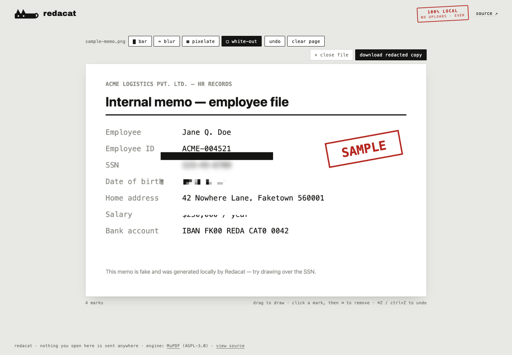

# Redacat 🐈‍⬛

**Redact images & PDFs entirely in your browser. Nothing leaves your device.**

**→ https://nipunbatra.github.io/redacat/**



## Why another redaction tool?

Most "redaction" fails one of two ways: the tool uploads your sensitive file to
someone's server, or it draws a black rectangle *on top of* the text and leaves
the text in the file (the classic lift-the-box leak). Redacat does neither.

- **True PDF redaction.** Marks are applied with [MuPDF](https://mupdf.com)'s
  redaction engine compiled to WebAssembly: text, images, and line art under a
  mark are **deleted from the file**, not covered. Verify with any text
  extractor — the content is gone from the raw bytes.
- **100% client-side.** No uploads, no servers, no analytics, no cookies. A
  strict `Content-Security-Policy` (`default-src 'none'`) makes network calls
  impossible after the page loads. It works in airplane mode.
- **Images are rebuilt, not annotated.** The export re-encodes pixels through a
  canvas, which also drops EXIF metadata (GPS location, camera, timestamps).

## Tools

| Tool | Files | What it does |
|---|---|---|
| █ bar | images + PDFs | solid black bar; in PDFs the content underneath is deleted |
| ≈ blur | images | Gaussian blur, adjustable strength |
| ▦ pixelate | images | mosaic, adjustable strength |
| ▢ white-out | images | correction-fluid white fill |
| ⌫ erase | PDFs | deletes content underneath, leaving blank paper |

Other niceties: paste a screenshot straight from the clipboard (⌘V), drag &
drop, multi-page PDFs, undo (⌘Z), click a mark + `⌫` to remove it, and a
built-in fake sample memo to try it on.

> **A note on blur/pixelate:** blurred or pixelated *text* can sometimes be
> reconstructed. For anything written, use the black bar — it destroys the data
> outright. (The app reminds you of this too.)

## Running locally / self-hosting

No build step. Serve the directory with any static file server:

```sh
python3 -m http.server 8000
# open http://localhost:8000
```

Everything is vendored — `vendor/mupdf/` contains the prebuilt
[mupdf npm package](https://www.npmjs.com/package/mupdf) (v1.28.0) dist files,
and the one webfont is self-hosted. The site makes zero external requests.

## How PDF redaction works here

1. Pages are rendered to pixels by MuPDF WASM for display.
2. Your rectangles are converted back to PDF coordinates and added as
   `Redact` annotations on a **fresh copy** of the original file.
3. `applyRedactions()` removes text (`REDACT_TEXT_REMOVE`), image regions
   (`REDACT_IMAGE_PIXELS`), and covered line art, then the file is saved with
   garbage collection (`garbage=2`) so removed objects don't linger.

## License

[AGPL-3.0](LICENSE) — required by the MuPDF engine, and a good fit for a
privacy tool anyway. Fonts: [Archivo Black](https://fonts.google.com/specimen/Archivo+Black) (OFL).
